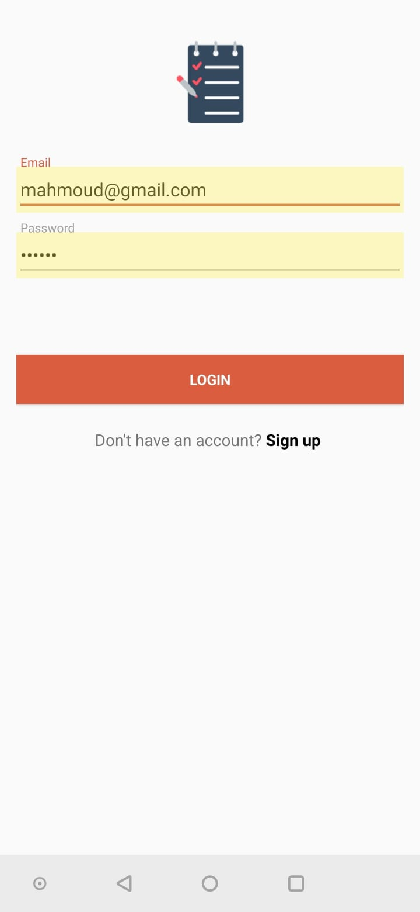
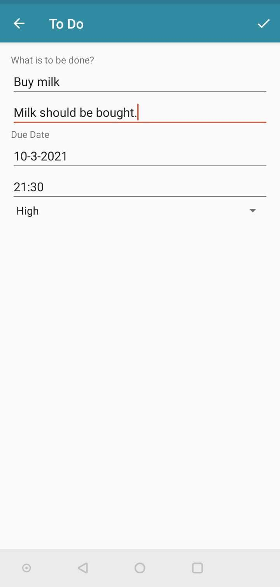

# To Do-Application
A simple android application, with which simple to do lists could be created. It enables the user to create, edit, and delete to do items. Used technologies: Java, Gradle and SQLite.
## Sample images from the application

