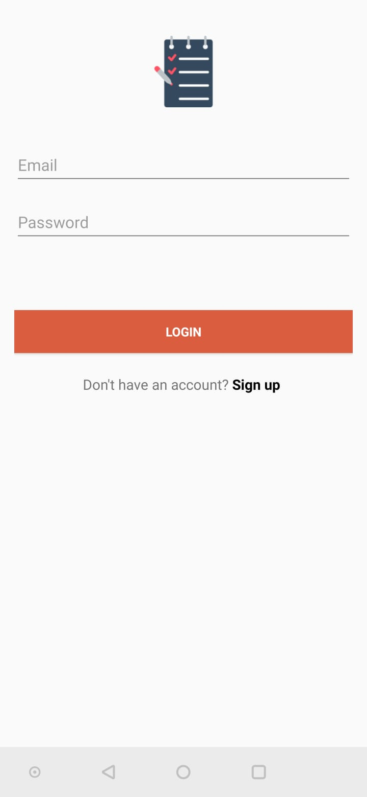

# To Do-Application
A simple android application, with which simple to do lists could be created. It enables the user to create, edit, and delete to do items. Used technologies: Java, Gradle and SQLite.
## Sample images from the application
App Icon

### Main page 1

### Main page 2

### Creating or editing a to do item 1

### Creating or editing a to do item 2

### Creating or editing a to do item 3

### Outdated to do item shown in another color

### Done item

